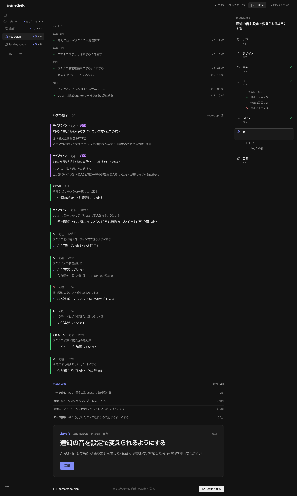
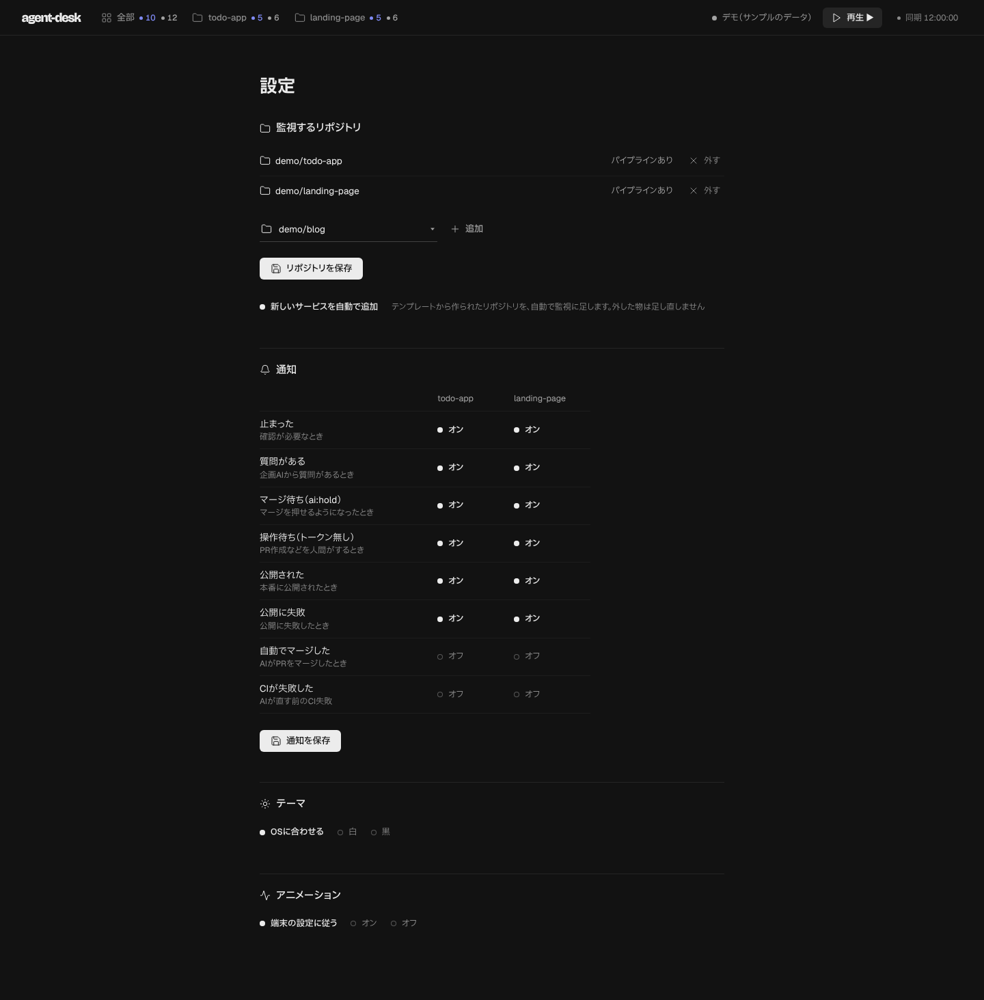
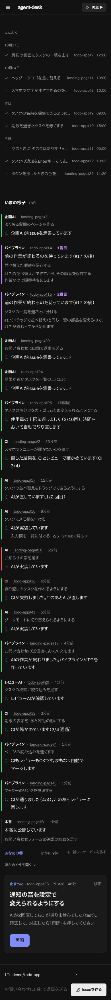

# agent-desk

AIに開発を任せるときの、**進行状況と「人間の判断待ち」を1画面で見る**ダッシュボード。


**[デモを見る](https://agent-desk-ip1u.vercel.app/demo)**（ログイン不要。サンプルのデータで、右上の「再生 ▶」を押すと上のGIFと同じ動きが見られます）

## 何ができるか

### PC：上の帯と、中央・右の2つの列

- **上の帯**（全ページ共通）：左から `Slots & Queue`（並列の枠の使われ方）→ `Dashboard`（期間の振り返り）→ `Repositories ▾`（監視しているリポジトリごとの「あなたの番」と「動いている」件数の一覧）。右端に `新サービス`（工場への入口）・同期・ユーザーのアイコン（設定・ログアウトのメニュー）
- **中央：いまの様子と、あなたの番**。会話アプリと同じく上が過去・下が最新です
  - いちばん上に、公開まで終わった物を日ごとに1行ずつ（監視に自動で足したリポジトリのお知らせも同じ並びに入ります）
  - その下に、動いている作業。題名の横のくるくる（止まっていれば ×）と、**AIがいま何をしているか**を1行で出します（AIの作業中のコメントか、動いているワークフローのステップ名から）
  - いちばん下に、AIが止まって人間の判断が要る物（あなたの番）。止まった・公開失敗を先に、待っている時間が長い順。その場で「再開」「マージ」などを押せ、AIからの質問や工場の相談には、選択肢を選んで答えられます
  - 最後に、1行のメモで Issue を作る入力欄
- **右：進捗図**。選んだ1件が、企画・デザイン・実装・CI・レビュー・修正・公開のどこまで進んだかを、上から下へ

`Dashboard` の一番上の **Services** には、Supabase・Vercel の CPU・GitHub の回数など、外のサービスの今の様子が1行ずつ並びます（止まりそうな物にすぐ気づくため）。

（下の画像は、帯が左のバーだった頃のホームです。撮り直しはホームの作り直しの後に行います）


### リポジトリのページ

同じ画面を、1つのリポジトリだけに絞って見られます。



### 新しいサービスを作る

`新サービス` から、作りたいサービスを1行書くと、[ai-dev-template](https://github.com/Gaku1205/ai-dev-template) の工場が新しいリポジトリを作り、公開まで進めます。途中の相談（何を作るか・見た目の方向・ざっくり画面）は「あなたの番」に出るので、ここで答えます。できたリポジトリは自動で監視に足せます。

### 設定：監視するリポジトリ・通知・アニメーション



### スマホでも

1列になり、Issue を作る入力欄はいつも下に出ます。



### そのほか

- GitHub の認証が切れたら、自動でログアウトしてログインの画面に戻ります
- キーボードだけで使えます（`?` で操作の一覧）

## どうやって作ったか

このアプリ自身も、[ai-dev-template](https://github.com/Gaku1205/ai-dev-template) の全自動パイプライン（メモを書く → AIが清書・実装・レビュー・修正・マージ → 公開）で、メモからAIが作りました。人間が書いたのは仕様書（[docs/spec.md](docs/spec.md)）とデザイン仕様（[docs/design.md](docs/design.md)）と、Issueのメモだけです。

その記録が、このリポジトリの [Issue](../../issues?q=is%3Aissue) と [Pull request](../../pulls?q=is%3Apr) の履歴です。

## 技術

Next.js（App Router）・TypeScript・Auth.js（GitHubログイン）・GitHub REST API・Vitest・Playwright・Vercel

Vercelは、`.github/` と `docs/pipeline.md` だけの変更では公開を飛ばします。

## セットアップ：動かすのに必要な設定

動かすには、環境変数6つと、GitHub の OAuth App が1つ要ります。手元なら `.env.local`、Vercel なら環境変数に入れます。

| 名前 | 内容 | 例 |
| --- | --- | --- |
| `AUTH_SECRET` | Auth.js の暗号化キー | `openssl rand -base64 32` の出力 |
| `AUTH_GITHUB_ID` | OAuth App の Client ID | `Ov23li...` |
| `AUTH_GITHUB_SECRET` | OAuth App の Client secret | （OAuth App の画面で作る） |
| `ALLOWED_GITHUB_LOGINS` | ログインを許可する GitHub ユーザー名（カンマ区切り） | `your-name` |
| `WATCHED_REPOS` | 監視するリポジトリ（`owner/repo` のカンマ区切り）。設定画面で保存した物があれば、そちらを使います | `your-name/app-a,your-name/app-b` |
| `SETTINGS_REPO` | 設定画面の保存先のリポジトリ（`owner/repo`。ふつうは agent-desk 自身）。無ければ設定画面の「監視するリポジトリ」は見るだけです | `your-name/agent-desk` |

`WATCHED_REPOS` は「見る対象」、`SETTINGS_REPO` は「設定を保存する場所」です。別の物です。

### GitHub OAuth App を作る

1. GitHub → Settings → Developer settings → OAuth Apps → New OAuth App
2. Homepage URL：公開URL（手元だけなら `http://localhost:3000`）
3. Authorization callback URL：`https://<公開URL>/api/auth/callback/github`（手元は `http://localhost:3000/api/auth/callback/github`）
4. 作ったあとの Client ID を `AUTH_GITHUB_ID` に、Client secret（Generate a new client secret）を `AUTH_GITHUB_SECRET` に入れる

ログインで頼む権限は、監視リポジトリが公開かどうかで自動で決まります（`read:user` と、全部公開なら `public_repo`、そうでなければ `repo`。詳しくは [docs/spec.md](docs/spec.md) の「ログインで頼む権限」）。OAuth App 側で選ぶ設定はありません。

### `AUTH_SECRET` を作る

```bash
openssl rand -base64 32
```

### 手元で動かす

1. `.env.example` を `.env.local` にコピーする（`cp .env.example .env.local`）
2. `.env.local` の値を、自分の物に書き換える
3. `npm install`
4. `npm run dev` で起動し、`http://localhost:3000` を開いて `GitHubでログイン` を押す

ログインできるのは `ALLOWED_GITHUB_LOGINS` に入れた人だけです。入っていない人は、日本語の「このアカウントでは使えません」の画面に戻ります。

## セットアップ：同期の読み取りをパイプラインのAppの鍵で行う（任意）

ふつうは、ログインした人（オーナー）のトークンで同期のデータを読みます。この回数制限（1時間5,000回）は、ほかのツール（`gh` など）と共有です。パイプラインのGitHub App（`gaku-ai-pipeline`）の鍵で読めば、別の回数（インストールごと）を使えます。

Vercel の agent-desk の環境変数に、パイプラインのSecretと同じ名前・同じ値で入れて、公開し直してください。

| 名前 | 値 |
| --- | --- |
| `PIPELINE_APP_ID` | AppのID |
| `PIPELINE_APP_PRIVATE_KEY` | 秘密鍵（`.pem` の中身。改行が `\n` の文字で入っていても読めます） |

- 入れなくても今までどおり動きます。Appが入っていないリポジトリ、鍵が取れないときも、ログインした人のトークンで読みます
- Appの鍵で読むのは、ログインした人のトークンで読めると確かめたリポジトリだけです。ボタンの操作は、いつもログインした人のトークンで行います
- 鍵はサーバーだけで使い、画面にもログにも出しません（詳しくは [docs/spec.md](docs/spec.md) の「読み取りの鍵」）

## セットアップ：GitHub の Webhook で、変わった時だけ取り直す（任意）

Appの鍵で読むリポジトリは、GitHub から「変わった」と知らせてもらった時だけ取り直し、数秒で画面に出します。何も変わっていない間は GitHub に問い合わせないので、パイプラインと共有のAppの回数制限を使い切りません。上の「Appの鍵で読む」設定をしてから、次の3つをしてください。

1. 合言葉を作る（パスワード生成などで、長いランダムな文字列）。Vercel の agent-desk の環境変数 `GITHUB_WEBHOOK_SECRET` に入れて、公開し直す
2. GitHub → Settings → Developer settings → GitHub Apps → パイプラインの App → General の Webhook：Active にチェック、URL に `https://<agent-desk のアドレス>/api/github/webhook`、Secret に同じ合言葉
3. 同じ App の Permissions & events → Subscribe to events で、Issues・Issue comment・Pull request・Pull request review comment・Check run・Status・Workflow run・Label にチェック（Check suite は使わないので、チェックは要りません。入っていても無視します）

- 入れなくても今までどおり動きます（決まった間隔で取り直します）。ログインした人のトークンで読むリポジトリも、今までどおりの間隔です
- Webhook が届かなかったときのため、覚えたデータは最大5分で取り直します。上端の「同期」を押せば、いつでもすぐ取り直します
- 設定画面で選んだ監視リポジトリは、Appの鍵で読みます（App に Variables の読み取りの権限が無いときは、App が入っているリポジトリの知らせを全部使います）
- 知らせの中身は保存せず、ログにも出しません（詳しくは [docs/spec.md](docs/spec.md) の「Webhook で取り直す」）

## READMEの画像の撮り直し

見た目を変えたときは、`npm run readme:shots` で `assets/readme/` の画像とGIFを撮り直します（初回は `npx playwright install chromium` が要ります）。
